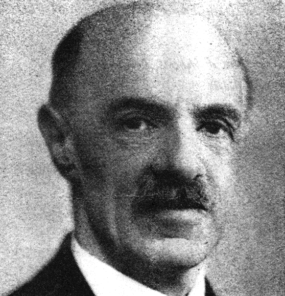
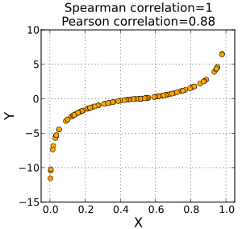
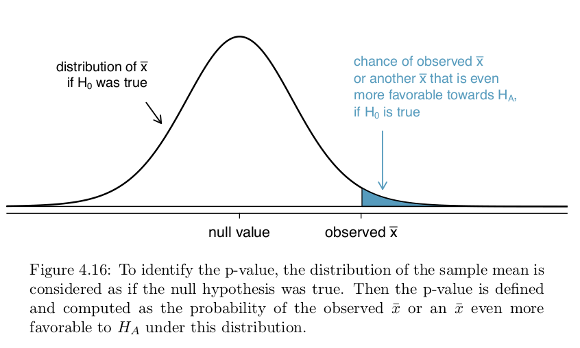
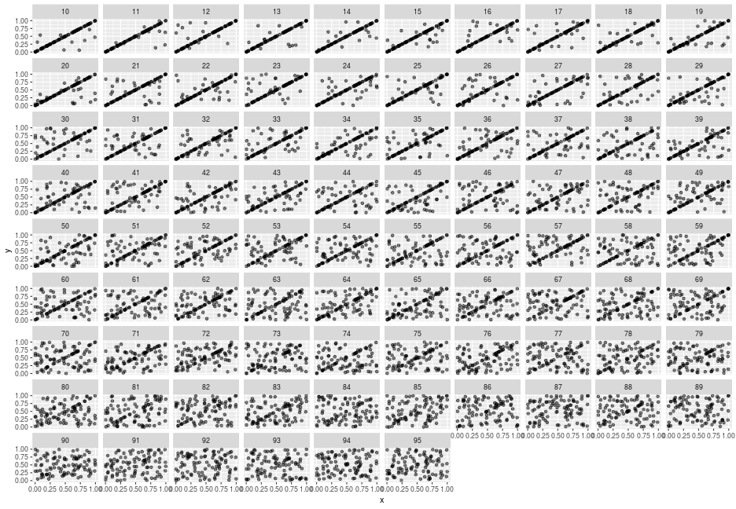
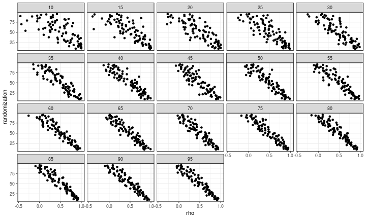
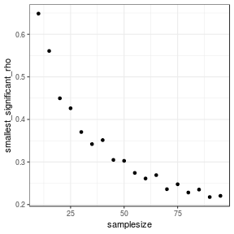

Let`s talk Spearman rank correlation
========================================================
author: Melanie Tietje
date: February 2019
autosize: true

<style>
.small-code pre code {
  font-size: 1em;
}
</style>


History
=======================================================
left: 20%
 

***

Charles Edward Spearman (1863 – 1945) was an English psychologist.

- studied "new psychology"---one that used the scientific method instead of metaphysical speculation
- elected member of the Royal Society 1924: "[For his] pioneer work in the application of mathematical methods to the analysis of the human mind, and his original studies of correlation in this sphere."
- feud with Karl Pearson, who also taught at the University College London (RLY?)


Spearman rank correlation test - recap
========================================================
left: 30%


***

- the non-parametric version for Pearson correlation
- rank correlation = statistical dependence between the rankings of two variables
- assesses how well the relationship between two variables can be described using a monotonic function
- the math:  $\rho = 1 - \frac{6\sum d ^2_i}{n(n^2-1)}$
  - $d_i$ = the difference between two ranks of each observation
  - $n$ = number of observations


P-value?
========================================================
left: 35%



***

"The p-value is the probability of observing data at least as favorable to the alternative hypothesis as our current data set, if the null hypothesis is true" [(Open Intro Statistics)](https://www.openintro.org/stat/textbook.php)

- Probability of observing this amount of correlation given there actually is no correlation (=observing by chance)
- A small p-value (usually < 0.05) corresponds to sufficient evidence to reject $H_0$ in favor of $H_A$
- z-statistic --> t-distribution --> p-value


Some test data
========================================================
class: small-code

```r
library(magrittr)
x <- runif(100, min = 0, max = 1) # our x variable
start <- 10 # minimum degree variation in y
end <- 95 # maximum degree variation in y

# create data
aval <- list()
for(step in start:end){
  scramble <- sample(c(1:100), step*0.01*length(x), replace = FALSE) # define which numbers to alter
  temp <- data.frame(x=x, y=x)
  temp$y[scramble] %<>% runif # actual randomization 
  aval[[step]] <-list(visible = FALSE,
                      name = paste0('v = ', step),
                      x=x,
                      y=temp$y,
                      rho=cor.test(x,temp$y,method="s")$estimate[[1]],
                      p=cor.test(x,temp$y,method="s")$p.[[1]]
  )
}
```
- creating a dataset with 2 variables, in which y is a copy of x with increasing degrees of randomization


Some test data
========================================================
class: small-code

```r
load("spearman.RData")
head(dat, 20)
```

```
            x          y random
1  0.63860736 0.63860736     10
2  0.64373766 0.64373766     10
3  0.09359379 0.09359379     10
4  0.42091535 0.53961715     10
5  0.03532037 0.03532037     10
6  0.31653066 0.31653066     10
7  0.89893546 0.89893546     10
8  0.23923984 0.23923984     10
9  0.69392201 0.69392201     10
10 0.89247378 0.89247378     10
11 0.68513072 0.68513072     10
12 0.10910229 0.10910229     10
13 0.82045396 0.82045396     10
14 0.70001250 0.70001250     10
15 0.71046496 0.71046496     10
16 0.45163949 0.45163949     10
17 0.14559774 0.14559774     10
18 0.11367611 0.11859527     10
19 0.89437855 0.89437855     10
20 0.19451756 0.19451756     10
```

Some test data
========================================================



Some test data - adding sample size
========================================================
class: small-code


```r
library(dplyr)
samplesize <- c()
rho <- c()
p.value <- c()
randomization <- c()
for(j in 1:length(samples_per_group)){ # run for each samplesize
  sub <- dat %>% # take subset from each randomization group
    group_by(random) %>%
    slice(sample(n(), min(samples_per_group[j], n()))) %>%
    ungroup()
  rho.sub <- c()
  p.sub <- c()
  for(i in start:end){ # calculate correlation for each randomization
    rho <- c(rho, cor.test(sub$x[sub$random==i],sub$y[sub$random==i],
                                   method="s")$estimate[[1]])
    p.value <- c(p.value, cor.test(sub$x[sub$random==i],sub$y[sub$random==i],
                               method="s")$p.[[1]])
    randomization <- c(randomization, i)
    samplesize <- c(samplesize, samples_per_group[j])
  }  
}
all <- data.frame(rho=rho, p.value=p.value, randomization=randomization, samplesize=samplesize)
```
- DF with rho and p-values for each degree of randomization (=correlation) for differing sample sizes

Some test data
========================================================
class: small-code

```r
head(all, 20)
```

```
         rho p.value randomization samplesize
1  0.9130879       0            10         95
2  0.9218785       0            11         95
3  0.8516797       0            12         95
4  0.8853443       0            13         95
5  0.9409854       0            14         95
6  0.9175392       0            15         95
7  0.8464306       0            16         95
8  0.8506019       0            17         95
9  0.8666433       0            18         95
10 0.8618841       0            19         95
11 0.7955067       0            20         95
12 0.6642497       0            21         95
13 0.8080627       0            22         95
14 0.7210386       0            23         95
15 0.8103863       0            24         95
16 0.7507279       0            25         95
17 0.7162514       0            26         95
18 0.8047312       0            27         95
19 0.7423992       0            28         95
20 0.7844765       0            29         95
```


Randomization effect on rho
========================================================

- The smaller sample size gets, the less predictable is the connection between randomization + rho


Rho and p-values
========================================================

[LETS EXPLORE RESULTS](file:///home/mel/Work/analysis/spearman_stuff/all_plot.html)


Threshold for p-values + sample size
========================================================
class: small-code
left: 30%



***

```r
summary(lm(data=res, log(smallest_significant_rho)~samplesize))
```

```

Call:
lm(formula = log(smallest_significant_rho) ~ samplesize, data = res)

Residuals:
     Min       1Q   Median       3Q      Max 
-0.11339 -0.08851 -0.01100  0.05852  0.23767 

Coefficients:
              Estimate Std. Error t value Pr(>|t|)    
(Intercept) -0.5553022  0.0559552  -9.924 3.05e-08 ***
samplesize  -0.0115485  0.0009555 -12.086 1.86e-09 ***
---
Signif. codes:  0 '***' 0.001 '**' 0.01 '*' 0.05 '.' 0.1 ' ' 1

Residual standard error: 0.1052 on 16 degrees of freedom
Multiple R-squared:  0.9013,	Adjusted R-squared:  0.8951 
F-statistic: 146.1 on 1 and 16 DF,  p-value: 1.855e-09
```


Back to the sqrt(question)
========================================================

- When I got a low correlation, how do I need to change the data to lose / get significance?
- How do I get a highly significant "non"-correlation?
- $$\rho = 1 - \frac{6\sum d ^2_i}{n(n^2-1)}$$

--> Looks like every sort of correlation gets strong if sample size is large enough 

--> low significant correlations always require large sample sizes


Get presentation and R scripts
========================================================

- [github.com/Eryops1](https://github.com/Eryops1/spearman_stuff)
- [R Presentations Support](https://support.rstudio.com/hc/en-us/articles/200486468-Authoring-R-Presentations)
- [Plotly](https://plot.ly/feed/#/)


<!-- TO DO
- add the math in earlier slide 
- add the initial question-->
